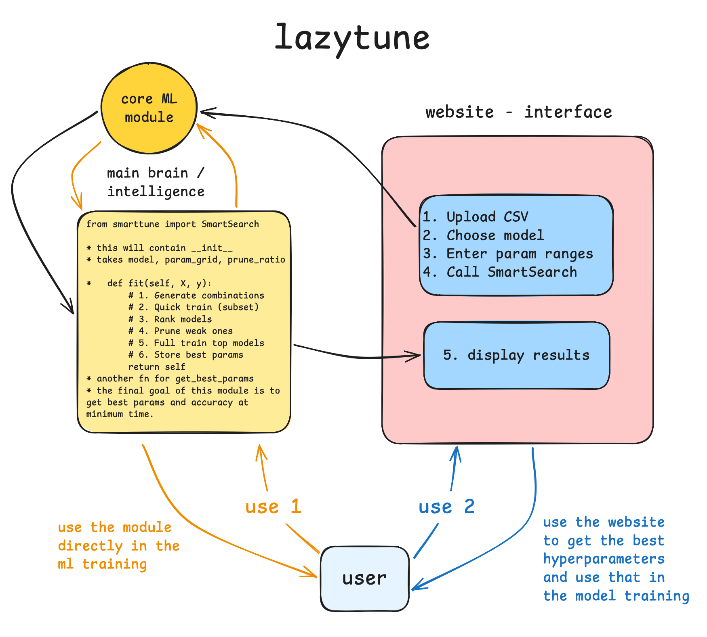
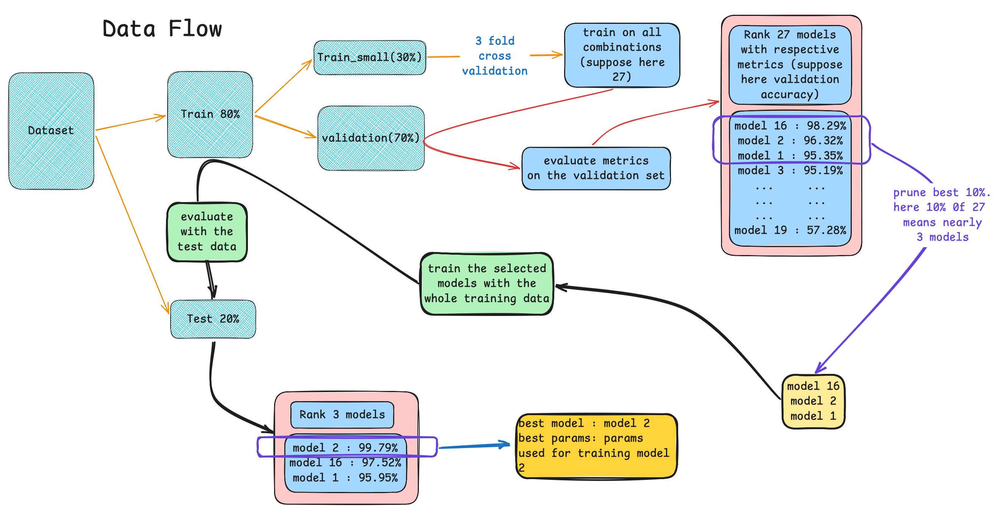

<div align="center">

# LazyTune 🚀



**Fast, smart, and lazy hyperparameter optimization**  
for scikit-learn models — up to **5–10× faster** than GridSearchCV  
with almost the same final performance.



<br>

[](https://pypi.org/project/lazytune/)
[](https://pypi.org/project/lazytune/)
[](https://opensource.org/licenses/MIT)

**Live Demo** → [https://lazytune.vercel.app](https://lazytune.vercel.app)  
**PyPI** → [https://pypi.org/project/lazytune/](https://pypi.org/project/lazytune/)

<br>

</div>

## 🔥 Why LazyTune?

- 100% compatible with **any scikit-learn-style estimator**
- Works for **classification** & **regression**
- Supports **all scikit-learn metrics** + custom scorers
- Smart pipeline: **screening → ranking → pruning → full training**
- Early **pruning** of poor configurations (`prune_ratio`)
- Parallel execution (`n_jobs`)
- Clean trial summaries & rankings in pandas DataFrame
- Returns best model, params, score + detailed report

<br>

## Installation

```bash
pip install lazytune
```

<br>

## Quick Start

```python
from sklearn.datasets import load_breast_cancer
from sklearn.ensemble import RandomForestClassifier
from lazytune import SmartSearch

X, y = load_breast_cancer(return_X_y=True)

param_grid = {
    "n_estimators": [50, 100, 150, 200],
    "max_depth": [5, 10, 15, None],
    "min_samples_split": [2, 3, 4, 5]
}

search = SmartSearch(
    estimator=RandomForestClassifier(random_state=42),
    param_grid=param_grid,
    metric="accuracy",
    cv_folds=3,
    prune_ratio=0.5,       # keep top 50% after screening
    n_jobs=-1              # use all cores
)

search.fit(X, y)

print("Best parameters:", search.best_params_)
print("Best CV score:   ", search.best_score_)
print("\nBest model:\n", search.best_estimator_)
```

<br>

## More Examples

### SVM Classification

```python
from sklearn.svm import SVC
from lazytune import SmartSearch

search = SmartSearch(
    estimator=SVC(random_state=42),
    param_grid={
        "C": [0.1, 1, 10, 50, 100],
        "kernel": ["linear", "rbf"],
        "gamma": ["scale", "auto", 0.001, 0.0001]
    },
    metric="f1_macro",
    cv_folds=5,
    prune_ratio=0.6
)
```

### Regression (Random Forest)

```python
from sklearn.ensemble import RandomForestRegressor
from lazytune import SmartSearch

search = SmartSearch(
    estimator=RandomForestRegressor(random_state=42),
    param_grid={
        "n_estimators": [100, 200, 300, 500],
        "max_depth": [8, 12, 16, None],
        "min_samples_split": [2, 4, 8]
    },
    metric="r2",
    cv_folds=4,
    n_jobs=-1
)
```

<br>

## Supported Metrics (examples)

### **Classification**

`accuracy` • `f1` • `f1_macro` • `f1_weighted` • `precision` • `recall` • `roc_auc` • `balanced_accuracy` • ...

### **Regression**

`r2` • `neg_mean_squared_error` • `neg_root_mean_squared_error` • `neg_mean_absolute_error` • ...

Custom metrics → use `sklearn.metrics.make_scorer`

<br>

## How LazyTune Works

1. Generate all (or sampled) hyperparameter combinations
2. Quick **screening** round with cross-validation
3. Rank configurations by performance
4. **Prune** bottom performers (`prune_ratio`)
5. Train remaining promising candidates thoroughly
6. Return best model + full trial summary

→ **Much faster** than GridSearchCV / RandomizedSearchCV  
→ Usually very close (or identical) final performance

<br>

## Main API – `SmartSearch`

### Key Attributes

| Attribute         | Description                                    |
| ----------------- | ---------------------------------------------- |
| `best_params_`    | Best hyperparameter dictionary                 |
| `best_score_`     | Best cross-validated score                     |
| `best_estimator_` | Fully fitted estimator with best parameters    |
| `summary_`        | pandas DataFrame with trial results & rankings |
| `cv_results_`     | Detailed CV results per candidate              |

### Main Methods

- `.fit(X, y)`
- `.predict(X)`
- `.score(X, y)`
- `.get_params()` / `.set_params()`

<br>

## Requirements

- Python ≥ 3.8
- numpy
- pandas
- scikit-learn

<br>

<div align="center">

**Made with ❤️ by [Anik Chand](https://github.com/anikchand461)**  
MIT License

Feedback, issues, stars, and contributions are **very welcome**! 🌟

[Try Live Demo](https://lazytune.vercel.app) • [Install from PyPI](https://pypi.org/project/lazytune/)

Happy tuning! 🚀

</div>
